# **Product Feature Performance Analysis**

## **Project Overview**
This project analyzes the performance of six newly launched product features in an e-commerce platform. The analysis focuses on understanding how each feature influences user behavior, engagement, adoption, conversion, revenue generation, and user retention. Using large-scale datasets (**6.6 GB+**) and Python for data analysis, the project provides actionable business insights to help stakeholders evaluate feature success and make data-driven product decisions.

## **Business Problem**
Over the past year, the company launched six new product features across its e-commerce platform. However, not all features contribute equally to business goals. Product managers need to understand which features successfully drive user engagement, conversions, repeat purchases, and revenue, and which ones require further improvements.

The company seeks to answer several critical business questions:
- **Which features achieve the highest adoption rates ?**
- **Which features drive meaningful user engagement ?**
- **How do product features impact conversion and revenue ?**
- **Are premium users interacting differently with product features compared to non-premium users ?**
- **Which features perform better for new users versus returning users ?**
- **How do feature performance and adoption vary across countries and over time ?**
- **Which features encourage repeat purchases and long-term user activity ?**

By answering these questions, the company can make informed product decisions, prioritize feature investments, and improve the overall user experience.

## **Project Goal**
The goal of this project is to evaluate the performance of product features by analyzing user adoption, engagement, conversion, and revenue impact. Through large-scale behavioral data, the project aims to identify which features create the most business value, understand how different user segments interact with each feature, and uncover opportunities to improve product performance, user retention, and overall customer experience.

Additionally, the project demonstrates practical techniques for analyzing large datasets efficiently using Python, with a focus on memory optimization, selective data loading, and scalable analytical workflows.

## **Executive Summary**
**NO SUMMARY YET**

## **Dataset Description**
| Table | Description | Rows |
|--------|-------------|------:|
| **users** | User profile information including signup date, subscription status, country, customer type, and premium membership details. | 300,000 |
| **products** | Product catalog containing product information such as category, price, and brand. | 15,000 |
| **features** | Product features available within the platform, including launch dates and feature metadata. | 6 |
| **sessions** | User browsing sessions capturing session duration, device type, pages viewed, and conversion status. | 6,000,000 |
| **feature_events** | Detailed event-level interactions between users and product features throughout each session. | 12,000,000 |
| **orders** | Customer orders including purchase date, payment method, order status, and total order value. | 420,000 |
| **order_items** | Individual products purchased within each order along with quantity and pricing information. | 1,500,000 |
| **feature_adoptions** | Records indicating when users first adopted or started using a specific feature. | 1,200,000 |
| **subscriptions** | Premium subscription history including subscription plans, start dates, and renewal information. | 200,000 |
| **user_daily_activity** | Daily user activity logs used to analyze engagement, active users, retention, and behavioral trends. | 15,000,000 |
> **Note:** This project uses a synthetic dataset (**~6.6 GB**) designed to simulate a real-world product analytics environment. The data follows realistic business rules, user behavior patterns, and intentional distribution imbalances to support practical feature performance analysis.

## **Schema Design**
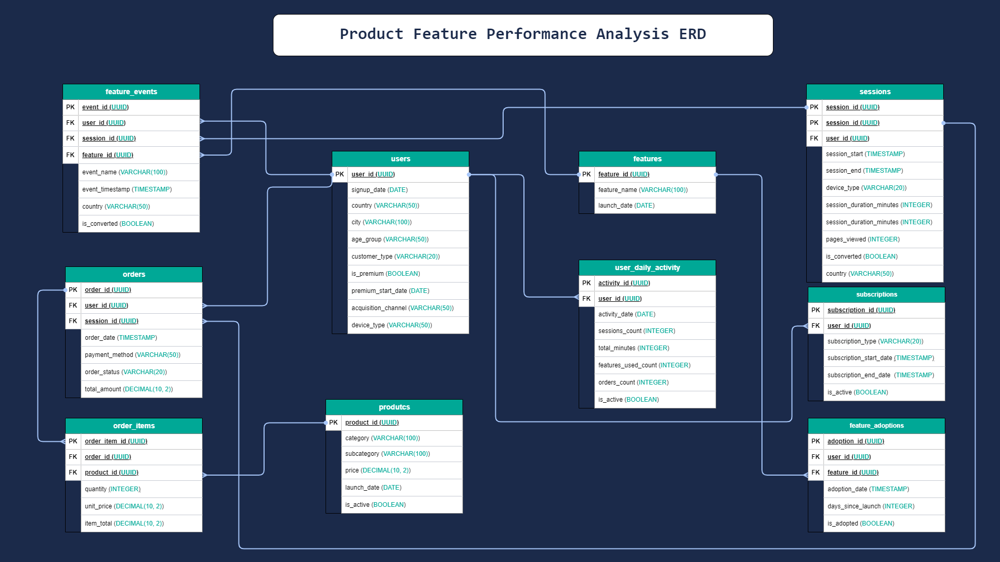

## **Data Preparation**
### **Data Quality Assessment**
The first step is to evaluate the quality of the users dataset before conducting any exploratory analysis.

The following checks will be performed:
- Exact duplicate records
- Missing values
- Primary key uniqueness
- Domain validation
- Business rule validation

### **Issues Found**
| Table          | Result                                    |
| -------------- | ----------------------------------------- |
| `users` | **No data quality issues were identified**. No duplicate records, missing values, primary key violations, or data type inconsistencies were identified. |
| `products` | **No data quality issues were identified**. No duplicate records, missing values, or primary key violations were found. The table passed all data quality validation checks and required no cleaning before analysis. |
| `orders` | **No data quality issues were identified**. The `orders` table contains no duplicate rows or missing values, the `order_id` primary key is unique, and all `user_id` and `session_id` foreign key references have valid matching records in their respective parent tables. |

### **Data Cleaning and Issue Handling**
**NO ACTIONS REQUIRED SO FAR**

## **Exploratory Data Analysis (EDA)**
### **Users Distribution by Country**
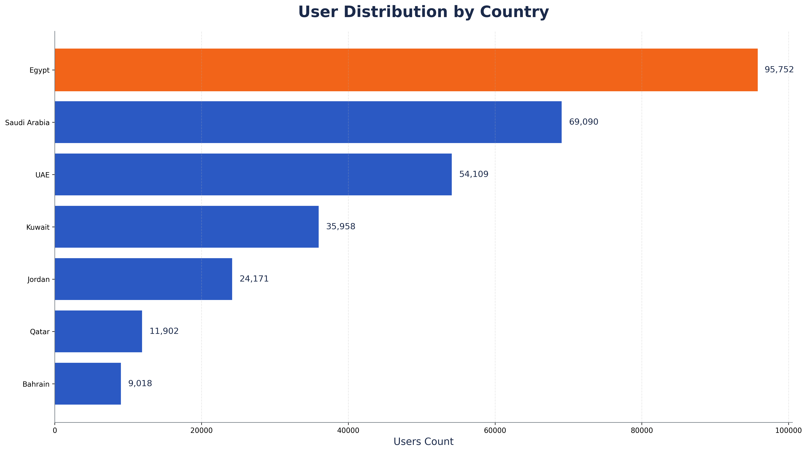
#### **Key Findings**
- **Egypt** has the largest user base, accounting for **31.92%** of all registered users.
- **Saudi Arabia** ranks second with **23.03%**, followed by the **UAE** at **18.04%**.
- **Bahrain** represents the smallest user segment, contributing only **3.01%** of the total user population.
- The user base is unevenly distributed across countries, with **Egypt** and **Saudi Arabia** together accounting for **more than half** of all registered users.
#### **Business Interpretation**
The user acquisition strategy appears to be concentrated in a limited number of markets, particularly **Egypt** and **Saudi Arabia**, where the majority of users are located. This geographic imbalance should be considered when interpreting downstream metrics such as feature adoption, engagement, conversion rate, and revenue. Cross-country comparisons should rely on normalized metrics (e.g., percentages or rates) rather than absolute user counts to avoid misleading conclusions driven by differences in market size.
### **Users Distribution by City**
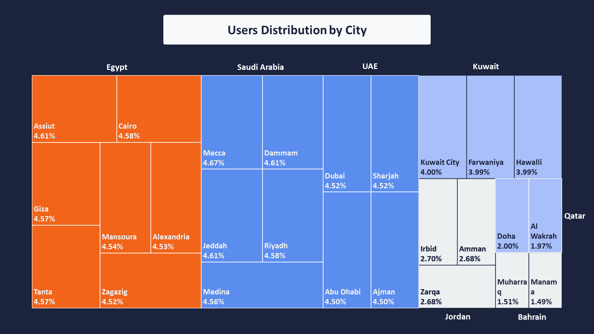
#### **Key Findings**
- User distribution across cities within each country is highly balanced, with only minor differences in user counts between cities.
- **Egypt**, **Saudi Arabia**, **UAE**, and **Kuwait** all exhibit a nearly uniform distribution of users across their major cities, indicating no single city dominates the user base.
- **Bahrain** has the **smallest** overall user base, while **Egypt** has the **largest**. This pattern is consistent with the country-level distribution observed previously.
#### **Business Interpretation**
The user base appears to have been intentionally distributed evenly across cities within each country rather than concentrated in a few major metropolitan areas. This balanced geographic distribution reduces location bias in subsequent analyses, allowing comparisons between cities without one city disproportionately influencing the results. At the same time, the overall differences in user volume between countries remain evident, with Egypt contributing the largest share of users and Bahrain the smallest, reflecting the country-level distribution rather than differences in city-level concentration.
### **Users Distribution by Age Group**
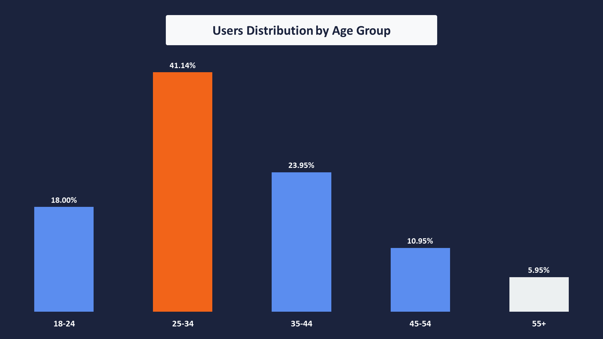
#### **Key Findings**
- The **25–34** age group represents the largest user segment, accounting for **41.14%** of the total user base.
- Users aged **35–44** represent the second-largest segment at **23.95%**, followed by the **18–24** group at **18.00%**.
- **Older users** are underrepresented in the dataset, with the **55+** age group contributing only **5.95%** of total users.
- **The age distribution is not uniform, indicating a clear concentration of users within the 25–44 age range**.
#### **Business Interpretation**
The dataset is heavily concentrated around users aged **25–44**, suggesting that the platform primarily serves a working-age audience. Since this segment represents nearly two-thirds of all registered users, overall platform metrics such as feature adoption, conversion, and engagement are likely to be driven primarily by these age groups. Consequently, age-based analyses should account for this imbalance, as results for older age groups may be less representative due to their relatively small sample sizes.
### **Users Distribution by Customer Type**
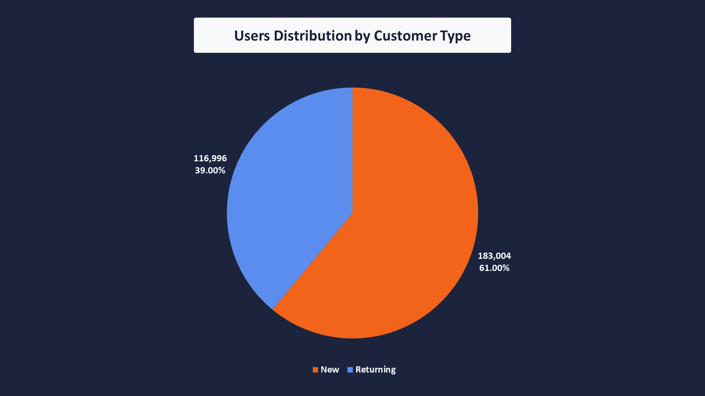
#### **Key Findings**
- **New** customers represent **61.00%** of the user base, while **Returning** customers account for **39.00%**.
- The customer type distribution is imbalanced, with new customers forming the majority of registered users.
- The difference between the two segments is substantial, indicating that the dataset contains considerably more new users than returning users.
#### **Business Interpretation**
The dataset contains a larger proportion of users labeled as **New** compared to **Returning** customers. At this stage, this observation should be treated as a characteristic of the dataset rather than evidence of actual customer acquisition behavior. Since the customer type is a predefined categorical attribute, additional analysis is required to determine whether this distribution reflects genuine business performance or simply the dataset's labeling and generation logic. This imbalance should, however, be considered when comparing metrics between the two customer segments.
### **Users Distribution by Premium Status**
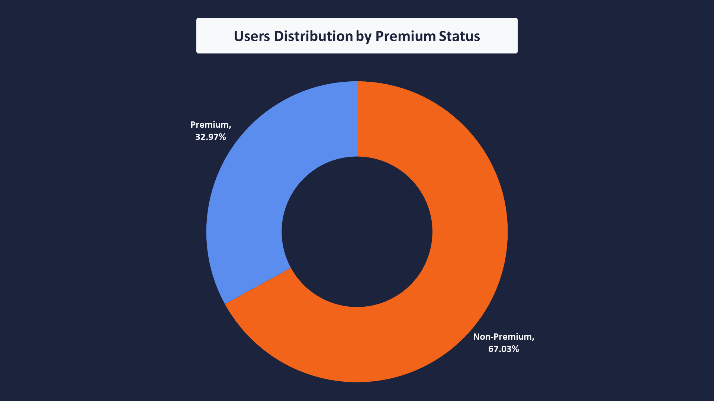
#### **Key Findings**
- **Non-premium** users represent **67.03%** of the total user base, while **Premium** users account for **32.97%**.
- The premium status distribution is imbalanced, with approximately two-thirds of users belonging to the non-premium segment.
- The difference between premium and non-premium users is substantial, making the non-premium segment the dominant user group in the dataset.
#### **Business Interpretation**
The dataset contains a significantly larger proportion of non-premium users than premium users. At this stage, this should be interpreted as a characteristic of the dataset rather than evidence of actual subscription performance or customer preference. Since premium status is a predefined user attribute, further analyses such as feature adoption, conversion rates, or purchasing behavior will be needed to determine whether premium membership is associated with different user behaviors. The observed imbalance should be considered when comparing metrics between the two user segments.
### **Users Distribution by Acquisition Channel**
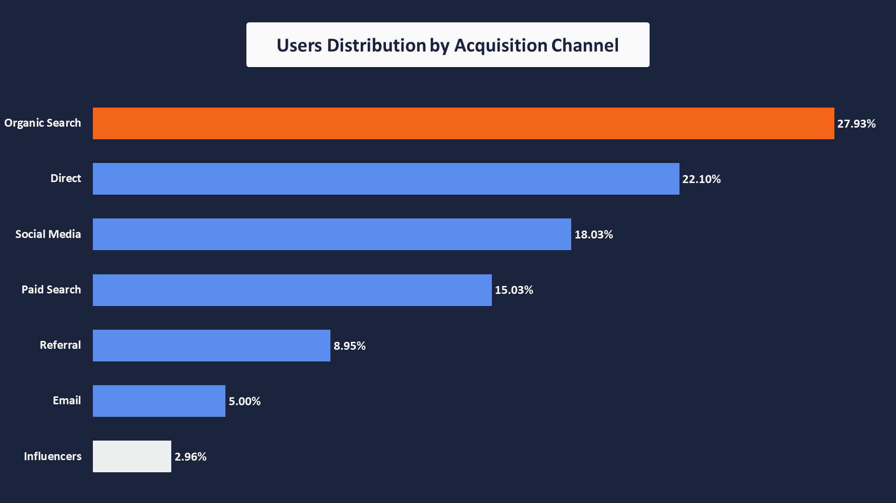
#### **Key Findings**
- **Organic Search** is the largest acquisition channel, contributing **27.93%** of the total user base.
- **Direct** is the **second-largest** acquisition source, accounting for **22.10%**, followed by **Social Media** at **18.03%**.
- **Influencers** contribute the smallest share of users at only **2.96%**, while **Email** represents **5.00%** of the user base.
- The acquisition channel distribution is not uniform, with users concentrated in a few dominant acquisition sources.
#### **Business Interpretation**
The dataset shows a clear imbalance across acquisition channels, with the majority of users originating from **Organic Search**, **Direct**, and **Social Media**. Since these channels contribute most of the user base, overall metrics such as feature adoption, engagement, and conversion are likely to be influenced primarily by users acquired through these sources. Consequently, channel-level comparisons should consider the unequal distribution of users to avoid drawing conclusions based solely on differences in segment size.
### **Users Distribution by Device Type**
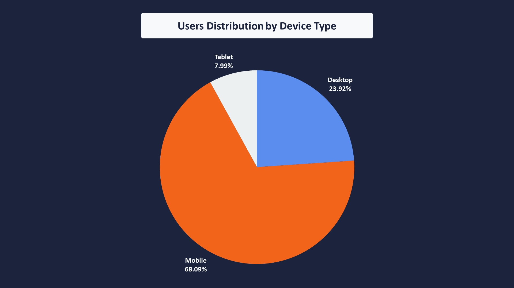
#### **Key Findings**
- **Mobile** is the dominant device type, accounting for **68.09%** of the total user base.
- **Desktop** users represent **23.92%**, making it the second most common device category.
- **Tablet** has the smallest user share at **7.99%**.
- The device distribution is highly imbalanced, with more than two-thirds of users accessing the platform via mobile devices.
#### **Business Interpretation**
The dataset is heavily skewed toward mobile users, indicating that most user interactions in subsequent analyses will originate from mobile devices. As a result, overall engagement, conversion, and feature usage metrics are likely to be influenced primarily by mobile users due to their substantially larger representation in the dataset. This imbalance should be considered when comparing user behavior across device types.
### **Users Monthly Signup Distribution**
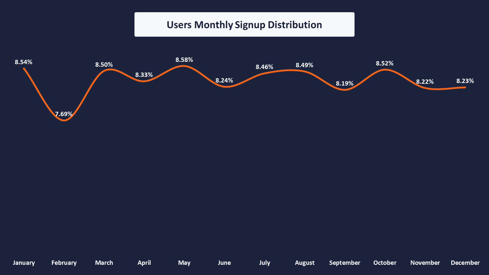
#### **Key Findings**
- Monthly user registrations remained relatively stable throughout **2025**, with monthly contributions ranging from **7.69%** to **8.58%** of the total user base.
- **May** recorded the highest number of registrations (**25,737 users, 8.58%**), while **February** recorded the lowest (**23,067 users, 7.69%**).
- Apart from the noticeable decline in February, month-to-month fluctuations are relatively small, indicating a balanced distribution of registrations over the year.
- No obvious spikes or prolonged periods of growth or decline are observed in the monthly registration counts.
#### **Business Interpretation**
User registrations remain consistent across most months, suggesting that the dataset does not exhibit strong seasonality or significant fluctuations in acquisition activity. The isolated decline observed in February is likely attributable to the shorter calendar month rather than a meaningful change in user acquisition behavior. Overall, the stable monthly distribution provides a balanced temporal foundation for subsequent analyses, reducing the risk that feature adoption or engagement metrics are disproportionately influenced by a specific registration period.
### **Premium subscription Monthly Distribution**
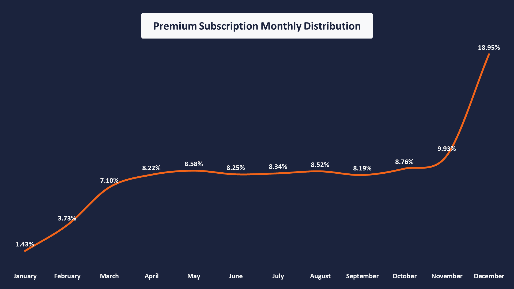
#### **Key Findings**
- User registrations exhibit a clear upward trend throughout the year, increasing from **1,415** registrations (**1.43%**) in **January** to **18,746** registrations (**18.95%**) in **December**.
- Registration growth is rapid during the first quarter, particularly between **January** and **March**.
- From **March** to **November**, monthly registrations remain relatively stable, fluctuating between **7.10%** and **9.93%** with only moderate month-to-month variation.
- **December** records a substantial increase compared with the preceding months, making it the highest registration month in the dataset.
#### **Business Interpretation**
The monthly registration pattern suggests that the user base expands rapidly during the early months before entering a relatively stable growth phase for most of the year. Although the difference between January and December appears large, the majority of months from March through November remain within a relatively narrow range, indicating that user acquisition stabilizes after the initial growth period. The sharp increase observed in December stands out from the rest of the year and should be considered separately when interpreting subsequent analyses, as it may disproportionately influence metrics based on user registration volume.
### **Products Distribution by Category**
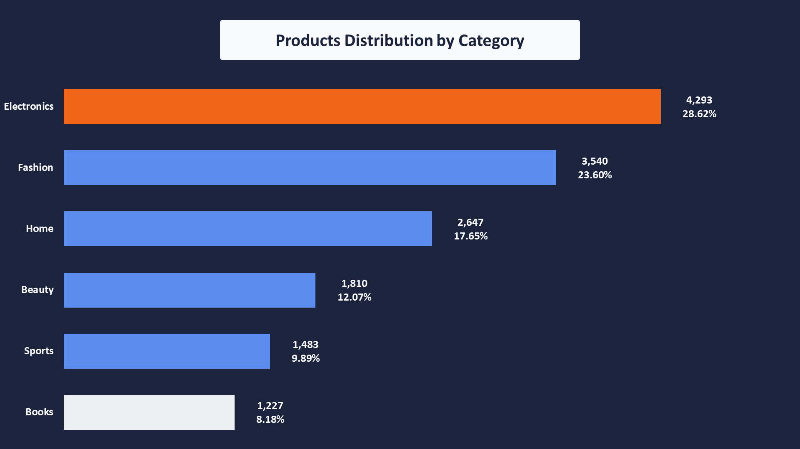
#### **Key Findings**
- **Electronics** is the largest product category, accounting for **4,293** products (**28.62%**) of the total catalog.
- **Fashion** ranks second with **3,540** products (**23.60%**), followed by **Home** with **2,647** products (**17.65%**).
- The **Books** category represents the smallest share of the catalog, contributing **1,227** products (**8.18%**).
- The **top three** categories (**Electronics, Fashion, and Home**) collectively account for approximately **68.5%** of all products, indicating that the product catalog is concentrated in a relatively small number of categories.
#### **Business Interpretation**
The product catalog is not evenly distributed across categories, **with nearly seventy percent of all products concentrated in the Electronics, Fashion, and Home categories**. This concentration suggests that these categories represent the primary focus of the business and are likely to generate the majority of user interactions. As a result, analyses related to feature adoption, engagement, or conversion may naturally be influenced by the distribution of products across these dominant categories. Consequently, category should be considered an important segmentation dimension in subsequent feature performance analyses.
### **Products Distribution by Subcategory**
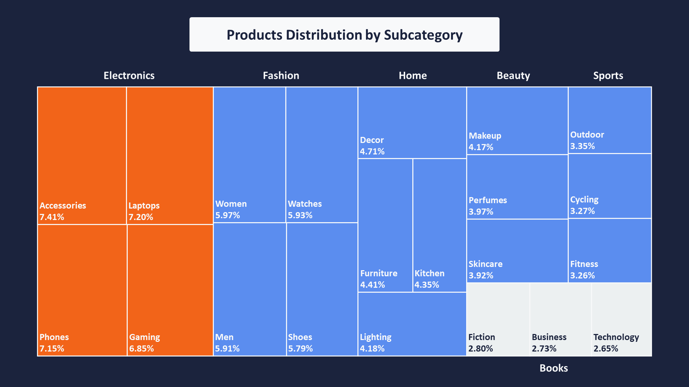
#### **Key Findings**
- Product distribution within each category is **relatively balanced**, with no single subcategory overwhelmingly dominating its parent category.
- In **Electronics**, products are distributed fairly evenly across **Accessories (7.41%)**, **Laptops (7.20%)**, **Phones (7.15%)**, and **Gaming (6.85%)**.
- A similar pattern is observed across the remaining categories, where subcategories contribute comparable shares of their respective parent categories.
- Although the overall product catalog is concentrated in a few major categories, no comparable concentration exists at the subcategory level.
#### **Business Interpretation**
While the overall catalog is concentrated within a small number of high-level product categories, the distribution of products across subcategories remains well balanced within each category. This indicates that the catalog offers broad coverage across different product segments rather than relying on a single dominant subcategory. Consequently, analyses performed at the subcategory level are less likely to be biased by product concentration, making subcategory a reliable dimension for segmenting feature usage, engagement, and conversion metrics.
### **Products Distribution by Active Status**
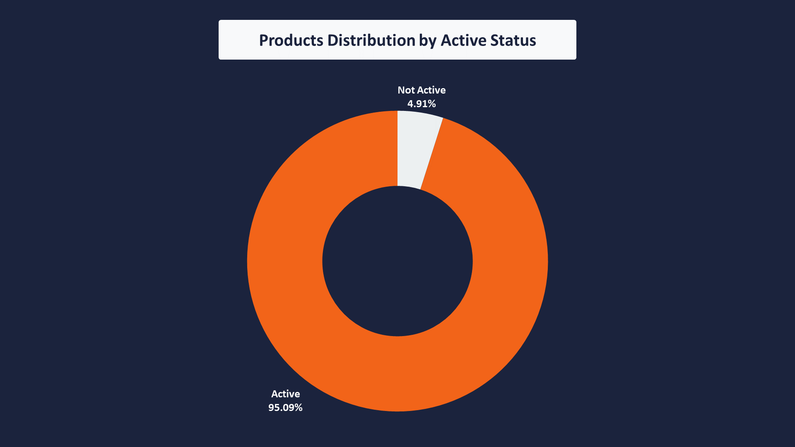
#### **Key Findings**
- The vast majority of products are marked as **Active**, representing **14,263** products (**95.09%**) of the catalog.
- Only **737** products (**4.91%**) are marked as **Not Active**.
- The product catalog is therefore heavily dominated by active products, with inactive products representing a relatively small portion of the dataset.
#### **Business Interpretation**
The dataset is predominantly composed of active products, indicating that subsequent analyses will primarily reflect the behavior of products currently available on the platform. However, the meaning of the `is_active` flag cannot be determined from the available data alone. Since no inventory, product lifecycle, or operational status information is provided, inactive products may represent out-of-stock items, discontinued products, temporarily unavailable products, or another business-defined status. Consequently, the `is_active` field should be treated as a categorical label rather than interpreted as evidence of a specific business process.
### **Products Price Summary Statistics**
| Metric          | value         |
| --------------- | ------------- |
| Minimum Price | 10.06           |
| Maximum Price | 3999.97         |
| Average Price | 1980.63         |
| Q1 (25%)      | 983.46          |
| Median (50%)  | 1987.65         |
| Q3 (75%)      | 2964.34         |
| IQR           | 1980.88         |
| Standard Deviation | 1145.72    |
| Coefficient of Variation (CV) | 57.85% |
| Lower Bounds  | -1987.85        |
| Upper Bounds  | 5935.65         |
#### **Key Findings**
- Product prices range from **10.06** to **3,999.97**, with no statistical outliers based on the IQR method.
- The **average** product price is **1,980.63**, while the **median** is **1,987.65**, indicating an approximately symmetric distribution with only a very slight negative skew.
- The middle **50%** of product prices fall between **983.46** and **2,964.34**.
- Product prices exhibit a **relatively wide spread**, with a **standard deviation of 1,145.72** (**approximately 58% of the average price**), indicating substantial price variation across the catalog.
#### **Business Interpretation**
The product catalog spans a broad range of price points while maintaining a relatively balanced price distribution. The absence of statistical outliers indicates that extreme prices are part of the expected pricing strategy rather than anomalies or data quality issues. At the same time, the substantial variation in product prices reflects the diversity of the catalog, which includes products targeting different customer segments and purchasing power. Consequently, price is expected to be an important explanatory variable when analyzing feature adoption, user engagement, and conversion behavior, as customers interacting with low-priced products may exhibit different behaviors from those purchasing premium products.
### **Products Distribution by Price Group**
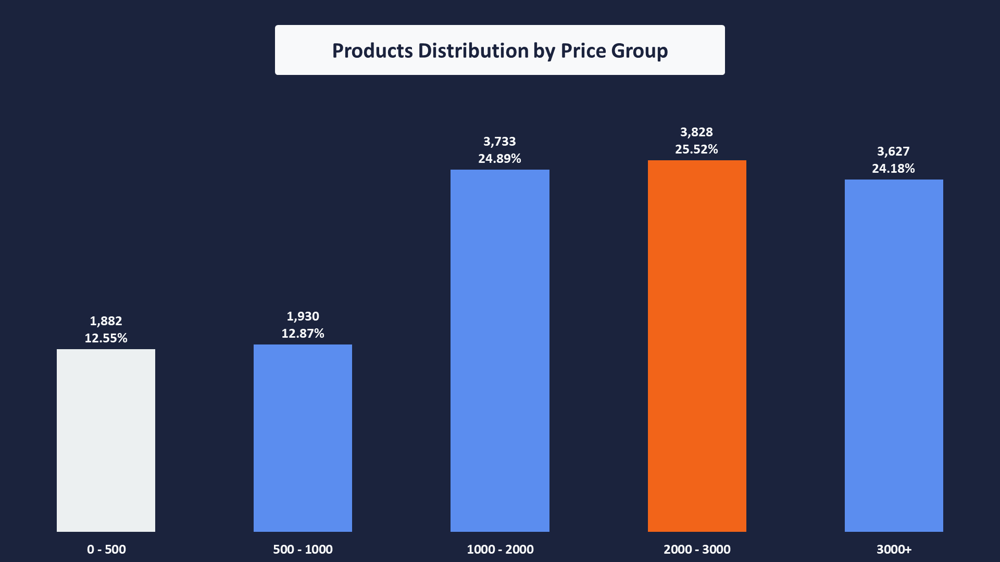
#### **Key Findings**
- Product prices are distributed across all price bands without heavy concentration in a single segment.
- The **2,000–3,000** price band contains the **largest** share of products (**25.52%**), closely followed by the **1,000–2,000** (**24.89%**) and **3,000+** (**24.18%**) price bands.
- Lower-priced products represent a smaller portion of the catalog, with **0–500** accounting for **12.55%** and **500–1,000** accounting for **12.87%**.
- **Approximately 75%** of all products are priced **above 1,000**, indicating that the catalog is primarily composed of medium- to high-priced products.
#### **Business Interpretation**
The catalog is predominantly positioned in the medium- and high-price segments rather than the budget segment. This pricing structure suggests that analyses involving user engagement, feature adoption, or purchasing behavior should account for product price as an important segmentation variable. Since three-quarters of the catalog consists of products priced above **1,000**, conclusions drawn from the overall dataset will naturally be influenced by customer interactions with medium- and premium-priced products.
### **Orders Overview**
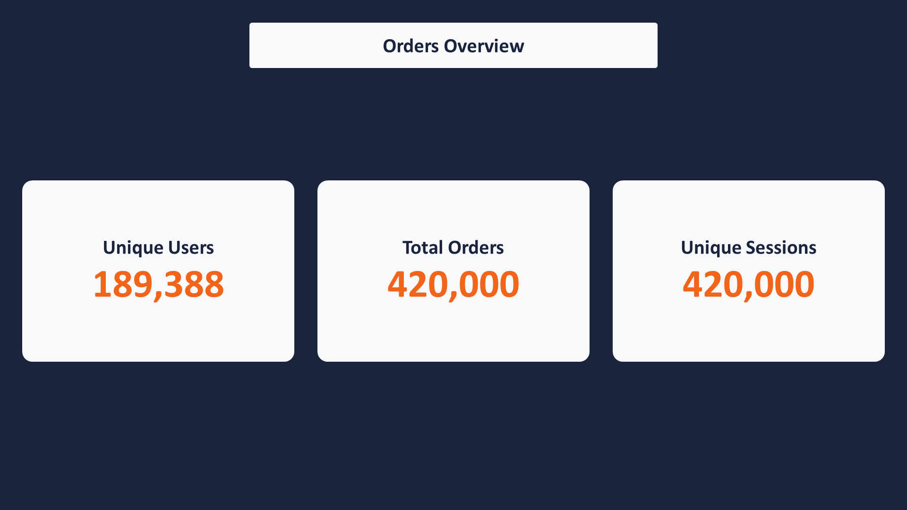
#### **Key Findings**
- The dataset contains **420,000** orders generated by **189,388 unique users** out of the **300,000** users in the overall user base.
- Approximately **63.13%** of users appear in the orders table, while the remaining users have no recorded order in this dataset.
- There are **420,000 unique sessions**, exactly matching the number of orders.
- This means that in the current dataset, each session associated with an order corresponds to exactly one order.
#### **Business Interpretation**
The orders dataset represents a substantial portion of the user base, with roughly two-thirds of users having at least one recorded order. The one-to-one relationship between order records and sessions is particularly notable: every **session** represented in the orders table generated exactly one order. However, this should not yet be interpreted as a session-to-order conversion rate, because the table only contains sessions that are already associated with orders; **sessions** that did not produce an order are not represented here. The actual conversion behavior will require comparison with the broader sessions or event data.
### **Order Status Distribution**
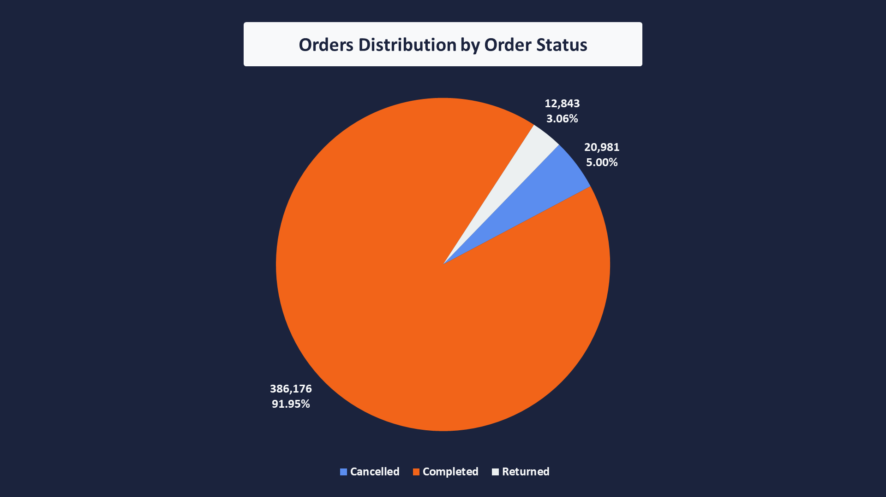
#### **Key Findings**
- **Completed orders** dominate the order distribution, accounting for **91.95%** of all orders.
- **Cancelled orders** represent **5.00%** of total orders.
- **Returned orders** represent **3.06%** of total orders.
- Overall, **8.06%** of orders are non-completed orders, consisting of cancellations and returns.
#### **Business Interpretation**
The order distribution indicates a strong completion rate, with the vast majority of recorded orders reaching the Completed status. However, the 8.06% of non-completed orders should not be treated as realized revenue when measuring actual business performance. Completed orders are the appropriate basis for metrics such as realized revenue and AOV, while cancelled and returned orders should be analyzed separately because they represent different forms of revenue leakage and operational friction: cancellations may indicate issues before fulfillment, whereas returns occur after the order has been placed and may point to product, fulfillment, or customer-experience issues.
### **Completed Orders by Unique Users**
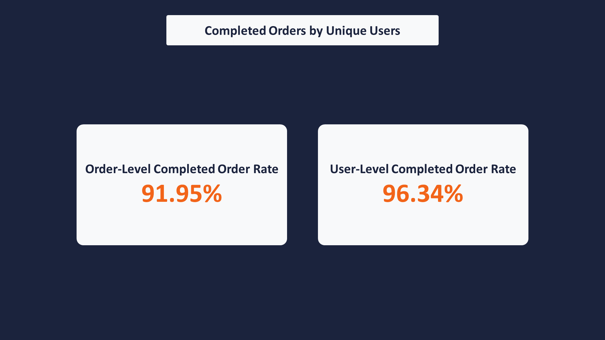
#### **Key Findings**
- **182,462** unique users have at least one Completed order.
- This represents approximately **96.34%** of the **189,388 unique** users who placed at least one order.
- Approximately **3.66%** of users who placed orders have no Completed order in the dataset.
#### **Business Interpretation**
The vast majority of users represented in the orders dataset have at least one Completed order, indicating that users with recorded orders are predominantly associated with successful transactions. The remaining approximately 3.66% of users have orders but no Completed order, meaning their recorded activity consists of cancelled and/or returned orders. This distinction is useful because the **91.95% Completed Order rate is calculated at the order level**, while the **96.34% figure is calculated at the user level**, so the two metrics describe different aspects of order performance and should not be treated as interchangeable.
### **Completed Orders by Session**
#### **Key Findings**
- **386,176 sessions** resulted in a Completed order.
- This represents approximately **91.95%** of all sessions represented in the `orders` table.
- The number of Completed-order sessions (**386,176**) exactly matches the number of Completed orders (**386,176**).
- This confirms the previously observed **1 session → 1 order** relationship within the `orders` dataset.
#### **Business Interpretation**
At the session level, the dataset shows a 91.95% completed-order rate, meaning that almost all sessions represented in the orders table are associated with successfully completed transactions. However, **this should not be interpreted as the overall session-to-order conversion rate**, because the `orders` table contains only sessions that generated an order; sessions that ended without an order are absent. Therefore, this metric is better understood as the share of order-associated sessions that resulted in Completed orders, while the actual conversion rate would require the full session population as the denominator.

